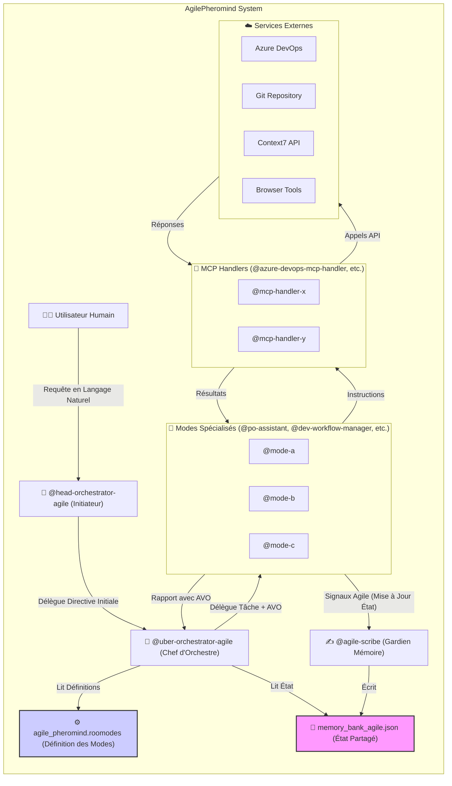
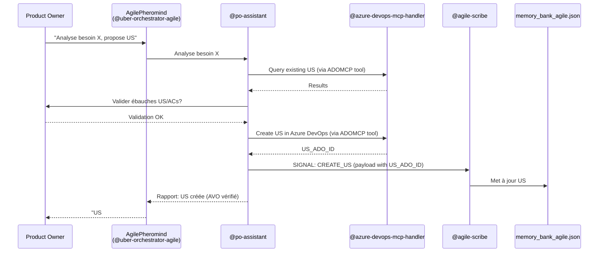
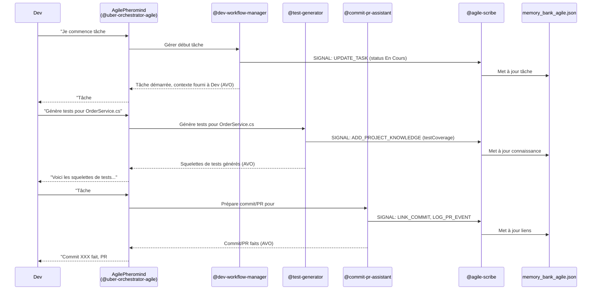

# AgilePheromind: Le Système d'Assistance IA pour Équipes Agiles

**Version:** 1.0
**Date de Dernière Mise à Jour:** [Date Actuelle]

## Table des Matières

- [AgilePheromind: Le Système d'Assistance IA pour Équipes Agiles](#agilepheromind-le-système-dassistance-ia-pour-équipes-agiles)
  - [Table des Matières](#table-des-matières)
  - [1. Introduction à AgilePheromind](#1-introduction-à-agilepheromind)
    - [1.1. Qu'est-ce qu'AgilePheromind ?](#11-quest-ce-quagilepheromind-)
    - [1.2. Objectifs du Système](#12-objectifs-du-système)
    - [1.3. Pour Qui ?](#13-pour-qui-)
  - [2. Concepts Clés d'AgilePheromind](#2-concepts-clés-dagilepheromind)
    - [2.1. Les Modes Roo Code (Agents IA Spécialisés)](#21-les-modes-roo-code-agents-ia-spécialisés)
    - [2.2. La Memory Bank Agile (`memory_bank_agile.json`)](#22-la-memory-bank-agile-memory_bank_agilejson)
    - [2.3. L'@agile-scribe : Le Gardien de la Mémoire](#23-lagile-scribe--le-gardien-de-la-mémoire)
    - [2.4. Les MCP Handlers : Portes vers les Services Externes](#24-les-mcp-handlers--portes-vers-les-services-externes)
    - [2.5. L'Orchestration (`@head-orchestrator-agile` \& `@uber-orchestrator-agile`)](#25-lorchestration-head-orchestrator-agile--uber-orchestrator-agile)
    - [2.6. AI Verifiable Outcomes (AVOs)](#26-ai-verifiable-outcomes-avos)
    - [2.7. Signaux Agile](#27-signaux-agile)
  - [3. Architecture Générale du Système](#3-architecture-générale-du-système)
  - [4. Manuel d'Utilisation par Rôle](#4-manuel-dutilisation-par-rôle)
    - [4.1. Pour le Product Owner (PO)](#41-pour-le-product-owner-po)
      - [4.1.1. Analyser un Besoin Client et Créer des US](#411-analyser-un-besoin-client-et-créer-des-us)
      - [4.1.2. Affiner une User Story Existante](#412-affiner-une-user-story-existante)
      - [4.1.3. Prioriser le Backlog](#413-prioriser-le-backlog)
    - [4.2. Pour le Développeur (Dev)](#42-pour-le-développeur-dev)
      - [4.2.1. Démarrer/Terminer une User Story](#421-démarrerterminer-une-user-story)
      - [4.2.2. Démarrer/Terminer une Tâche Technique](#422-démarrerterminer-une-tâche-technique)
      - [4.2.3. Obtenir de la Documentation Technique](#423-obtenir-de-la-documentation-technique)
      - [4.2.4. Générer des Squelettes de Tests](#424-générer-des-squelettes-de-tests)
      - [4.2.5. Préparer un Commit et une Pull Request](#425-préparer-un-commit-et-une-pull-request)
    - [4.3. Pour le Tech Lead (TL)](#43-pour-le-tech-lead-tl)
      - [4.3.1. Demander une Revue de Code Assistée](#431-demander-une-revue-de-code-assistée)
    - [4.4. Pour le Scrum Master (SM) / Équipe](#44-pour-le-scrum-master-sm--équipe)
      - [4.4.1. Préparer le Sprint Planning](#441-préparer-le-sprint-planning)
      - [4.4.2. Obtenir un Résumé du Daily Stand-up](#442-obtenir-un-résumé-du-daily-stand-up)
      - [4.4.3. Préparer la Sprint Review](#443-préparer-la-sprint-review)
      - [4.4.4. Assister la Rétrospective](#444-assister-la-rétrospective)
    - [4.5. Tâches Avancées / Maintenance (TL / Admin AgilePheromind)](#45-tâches-avancées--maintenance-tl--admin-agilepheromind)
      - [4.5.1. Lancer une Analyse de la Base de Connaissance](#451-lancer-une-analyse-de-la-base-de-connaissance)
      - [4.5.2. Demander un Scan des Risques Projet](#452-demander-un-scan-des-risques-projet)
      - [4.5.3. Consulter les Logs d'Erreurs Système](#453-consulter-les-logs-derreurs-système)
      - [4.5.4. Interroger la Base de Connaissance](#454-interroger-la-base-de-connaissance)
      - [4.5.5. Demander une Visualisation de Données](#455-demander-une-visualisation-de-données)
  - [5. Stack Technique et Prérequis](#5-stack-technique-et-prérequis)
  - [6. Contributions et Évolutions Futures](#6-contributions-et-évolutions-futures)
  - [7. Glossaire des Modes AgilePheromind](#7-glossaire-des-modes-agilepheromind)

---

## 1. Introduction à AgilePheromind

### 1.1. Qu'est-ce qu'AgilePheromind ?
AgilePheromind est un système d'assistance avancé basé sur l'intelligence artificielle (IA), conçu pour augmenter l'efficacité et la productivité des équipes de développement logiciel travaillant en méthodologie Agile. Il est construit sur la plateforme Roo Code et s'inspire des principes d'intelligence collective et de gestion d'état de Pheromind.
AgilePheromind se compose d'un ensemble d'agents IA spécialisés, appelés "Modes Roo Code", chacun expert dans un domaine particulier du cycle de vie Agile (gestion de produit, développement, test, DevOps, etc.). Ces modes collaborent, partagent des informations via une "Memory Bank Agile" centrale, et interagissent avec les outils de l'équipe (comme Azure DevOps, Git) pour automatiser les tâches répétitives, fournir des analyses pertinentes, et assister les membres de l'équipe dans leurs activités quotidiennes.

### 1.2. Objectifs du Système
*   **Accélérer le développement** en automatisant les tâches chronophages (création de boilerplate, génération de tests, préparation de commits).
*   **Améliorer la qualité** en fournissant une assistance à la revue de code, à la détection de problèmes, et en encourageant le respect des conventions.
*   **Faciliter la collaboration** en maintenant une source de vérité partagée (la Memory Bank Agile) accessible à tous les membres de l'équipe et à tous les modes IA.
*   **Augmenter la productivité du Product Owner** en l'aidant à analyser les besoins et à rédiger des User Stories de qualité.
*   **Soutenir le Scrum Master** en fournissant des données pour les cérémonies Agile.
*   **Permettre une amélioration continue** grâce à des modes dédiés à l'analyse des processus et des connaissances du projet.

### 1.3. Pour Qui ?
AgilePheromind est conçu pour les équipes de développement Agile, en particulier celles utilisant :
*   **Technologies :** .NET (Core) pour le backend, Angular pour le frontend.
*   **Plateforme de Gestion de Projet :** Azure DevOps.
*   **Contrôle de Version :** Git (hébergé sur Azure Repos ou GitHub).
*   **Déploiement :** Docker, Azure Kubernetes Service (AKS), Azure Pipelines.

Il s'adresse à tous les rôles de l'équipe : Product Owners, Développeurs, Tech Leads, Testeurs, et Scrum Masters.

## 2. Concepts Clés d'AgilePheromind

### 2.1. Les Modes Roo Code (Agents IA Spécialisés)
Au cœur d'AgilePheromind se trouvent les "Modes Roo Code". Ce sont des agents IA, chacun avec une expertise et un rôle précis (défini dans `agile_pheromind.roomodes`). Par exemple, `@po-assistant` aide le Product Owner, `@test-generator` génère des tests, `@code-reviewer-assistant` assiste le Tech Lead. Chaque mode a des instructions spécifiques (`customInstructions`) qui guident son comportement.

### 2.2. La Memory Bank Agile (`memory_bank_agile.json`)
C'est le cerveau centralisé du projet. Ce fichier JSON stocke l'état complet et évolutif du projet :
*   Contexte du projet (nom, équipe, sprint actuel, préférences de l'équipe).
*   Détails des User Stories et des Tâches (description, statut, assignation, estimations, liens avec Azure DevOps).
*   État actuel des développeurs (sur quelle US/Tâche ils travaillent).
*   Base de connaissance du projet (`projectKnowledge`) : conventions de codage, décisions d'architecture, liens utiles, templates, glossaire.
*   Historique des sprints, des revues de PR, des risques, des erreurs système, et un journal d'audit.
Elle est la source de vérité pour tous les modes et permet une collaboration contextuelle.

### 2.3. L'@agile-scribe : Le Gardien de la Mémoire
Le mode `@agile-scribe` est le **seul** agent autorisé à écrire directement dans la `memory_bank_agile.json`. Les autres modes lui envoient des "Signaux Agile" (des directives JSON structurées) pour demander des mises à jour. Cela garantit la cohérence et l'intégrité de la Memory Bank. Il gère également l'archivage des anciennes données pour maintenir la performance.

### 2.4. Les MCP Handlers : Portes vers les Services Externes
Pour interagir avec des services externes comme Azure DevOps, Git, Context7, ou les outils de navigateur, AgilePheromind utilise des "MCP Handlers" (ex: `@azure-devops-mcp-handler`, `@git-tools-mcp-handler`). Ce sont des modes spécialisés qui encapsulent la logique d'appel direct aux Model Context Protocol (MCP) servers. Les modes "métier" (comme `@po-assistant`) donnent des instructions sémantiques aux handlers, qui se chargent de la communication technique. Cela rend le système modulaire et facile à adapter si un MCP change.

### 2.5. L'Orchestration (`@head-orchestrator-agile` & `@uber-orchestrator-agile`)
*   **`@head-orchestrator-agile`**: C'est le point d'entrée initial. Il reçoit la requête de l'utilisateur et la transmet à l'`@uber-orchestrator-agile`.
*   **`@uber-orchestrator-agile`**: C'est le chef d'orchestre principal. Il lit la `memory_bank_agile.json` pour comprendre l'état actuel, analyse la directive, consulte les définitions des modes dans `agile_pheromind.roomodes`, et délègue des tâches aux modes spécialisés appropriés. Il s'assure que chaque tâche déléguée a un "AI Verifiable Outcome".

### 2.6. AI Verifiable Outcomes (AVOs)
Chaque tâche assignée à un mode IA doit avoir un "Résultat Vérifiable par une IA" (AVO). C'est un critère objectif qui permet à l'orchestrateur (ou au mode lui-même) de confirmer si la tâche a été accomplie avec succès. Exemples : "Le fichier X a été créé à l'emplacement Y", "L'User Story Z a le statut 'Terminé' dans Azure DevOps ET dans la Memory Bank", "Le rapport de test indique 0 échec". Les AVOs sont essentiels pour l'autonomie et la fiabilité du système.

### 2.7. Signaux Agile
Ce sont des messages JSON structurés que les modes envoient à `@agile-scribe` pour demander une modification de la `memory_bank_agile.json`. Chaque signal a un `SIGNAL_TYPE` (ex: `CREATE_US`, `UPDATE_TASK_STATUS`) et un `payload` contenant les données nécessaires. Cela assure une mise à jour contrôlée et traçable de l'état.

## 3. Architecture Générale du Système

Le schéma Mermaid ci-dessus illustre l'architecture :
*   L'**Utilisateur Humain** interagit avec le **`@head-orchestrator-agile`**.
*   Le **`@head-orchestrator-agile`** active l'**`@uber-orchestrator-agile`**.
*   L'**`@uber-orchestrator-agile`** lit la **`memory_bank_agile.json`** et les **`agile_pheromind.roomodes`** pour prendre des décisions.
*   Il délègue des tâches (avec AVOs) aux **Modes Spécialisés**.
*   Les **Modes Spécialisés** peuvent utiliser des **MCP Handlers** pour interagir avec des **Services Externes**.
*   Les **Modes Spécialisés** envoient des **Signaux Agile** à l'**`@agile-scribe`** pour mettre à jour la **`memory_bank_agile.json`**.
*   Les **Modes Spécialisés** rapportent à l'**`@uber-orchestrator-agile`** la complétion de leur tâche et la vérification de leur AVO.

## 4. Manuel d'Utilisation par Rôle

Voici comment les différents rôles de l'équipe Agile peuvent interagir avec AgilePheromind. Les commandes sont données en langage naturel à l'interface Roo Code (qui activera `@head-orchestrator-agile`).

### 4.1. Pour le Product Owner (PO)

Utilise principalement le mode **`@po-assistant`** (orchestré par `@uber-orchestrator-agile`).

#### 4.1.1. Analyser un Besoin Client et Créer des US
*   **Commande Exemple :** `"@AgilePheromind, analyse ce besoin client : 'Nos utilisateurs souhaitent pouvoir exporter leurs factures en PDF pour leur comptabilité.' et propose des User Stories."`
*   **Actions d'AgilePheromind :**
    1.  `@po-assistant` décompose le besoin.
    2.  Vérifie (via `@azure-devops-mcp-handler`) si des US similaires existent dans Azure DevOps.
    3.  Propose des ébauches d'US (ex: "En tant qu'utilisateur, je veux un bouton 'Exporter en PDF' sur la page facture afin de télécharger ma facture.") et des Critères d'Acceptation (ACs).
    4.  Après validation du PO, `@po-assistant` instruit `@azure-devops-mcp-handler` de créer l'US dans Azure DevOps.
    5.  `@po-assistant` envoie un signal `CREATE_US` à `@agile-scribe` pour l'ajouter à la `memory_bank_agile.json`.
*   **AVO :** US créée dans ADO et Memory Bank.

#### 4.1.2. Affiner une User Story Existante
*   **Commande Exemple :** `"@AgilePheromind, aide-moi à affiner l'US #12345 ('Gestion du profil'). Les ACs manquent de détails sur la modification du mot de passe."`
*   **Actions d'AgilePheromind :**
    1.  `@po-assistant` récupère l'US #12345 (via `@azure-devops-mcp-handler`).
    2.  Pose des questions ciblées au PO pour clarifier les ACs du changement de mot de passe.
    3.  Propose des ACs mis à jour.
    4.  Après validation, met à jour l'US dans Azure DevOps et envoie un signal `UPDATE_US` à `@agile-scribe`.
*   **AVO :** US mise à jour dans ADO et Memory Bank.

#### 4.1.3. Prioriser le Backlog
*   **Commande Exemple :** `"@AgilePheromind, montre-moi les US du backlog prêtes pour développement, triées par valeur métier et avec une complexité estimée inférieure à 8 points."`
*   **Actions d'AgilePheromind :**
    1.  `@po-assistant` récupère les US candidates (via `@azure-devops-mcp-handler`) et leurs données de valeur/complexité (depuis ADO ou Memory Bank).
    2.  Présente la liste filtrée/triée.
    3.  Le PO peut alors indiquer les changements de priorité.
    4.  `@po-assistant` met à jour les priorités dans Azure DevOps et envoie des signaux `UPDATE_US` à `@agile-scribe`.
*   **AVO :** Priorités des US mises à jour dans ADO et Memory Bank.

### 4.2. Pour le Développeur (Dev)

Utilise principalement le mode **`@dev-workflow-manager`** et les modes qu'il orchestre.

#### 4.2.1. Démarrer/Terminer une User Story
*   **Commande Exemple (Démarrer) :** `"@AgilePheromind, je commence à travailler sur l'US #US123."`
*   **Actions d'AgilePheromind (`@dev-workflow-manager`):**
    1.  Met à jour le statut de l'US dans Azure DevOps à "En Cours" et l'assigne au Dev.
    2.  Met à jour la `memory_bank_agile.json` (`developerContext`, statut US) via `@agile-scribe`.
    3.  Présente les détails de l'US au Dev.
    4.  Vérifie si des tâches existent pour l'US; si non, propose d'appeler `@task-breakdowner`.
*   **AVO :** Statut US et contexte Dev mis à jour dans ADO et Memory Bank.
*   **Commande Exemple (Terminer) :** `"@AgilePheromind, j'ai terminé l'US #US123."`
*   **Actions d'AgilePheromind (`@dev-workflow-manager`):**
    1.  Vérifie si toutes les tâches liées sont terminées.
    2.  Met à jour le statut de l'US dans Azure DevOps (ex: "Prêt pour Test").
    3.  Met à jour la Memory Bank.
*   **AVO :** Statut US mis à jour.

#### 4.2.2. Démarrer/Terminer une Tâche Technique
*   **Commande Exemple (Démarrer) :** `"@AgilePheromind, je prends la tâche #TASK501 (pour l'US #US123)."`
*   **Actions d'AgilePheromind (`@dev-workflow-manager`):**
    1.  Met à jour le statut de la tâche dans ADO à "En Cours" et l'assigne.
    2.  Met à jour la Memory Bank.
    3.  Fournit le contexte de la tâche (description, ACs de l'US, conventions .NET/Angular pertinentes depuis `projectKnowledge`).
    4.  Suggère des assistances (ex: appel à `@doc-scout`, `@dotnet-code-generator`).
*   **AVO :** Statut Tâche et contexte Dev mis à jour.
*   **Commande Exemple (Terminer) :** `"@AgilePheromind, tâche #TASK501 terminée."`
*   **Actions d'AgilePheromind (`@dev-workflow-manager`):**
    1.  Propose d'appeler `@commit-pr-assistant`.
    2.  Après commit/PR, met à jour le statut de la tâche dans ADO à "Terminé".
    3.  Met à jour la Memory Bank.
*   **AVO :** Statut Tâche mis à jour.

#### 4.2.3. Obtenir de la Documentation Technique
*   **Commande Exemple :** `"@AgilePheromind, trouve la documentation sur 'Angular HttpClient interceptors'."`
*   **Actions d'AgilePheromind (`@uber-orchestrator-agile` délègue à `@doc-scout`):**
    1.  `@doc-scout` utilise `@context7-mcp-handler` puis `@fetch-mcp-handler` pour rechercher.
    2.  Fournit un résumé, des snippets et des liens au Dev.
    3.  Peut suggérer un ajout à `projectKnowledge.usefulDocs` via `@agile-scribe`.
*   **AVO :** Résumé de documentation fourni.

#### 4.2.4. Générer des Squelettes de Tests
*   **Commande Exemple :** `"@AgilePheromind, génère les tests unitaires xUnit pour la classe 'OrderService.cs' dans mon projet .NET."`
*   **Actions d'AgilePheromind (`@uber-orchestrator-agile` délègue à `@test-generator`):**
    1.  `@test-generator` analyse le code (via `@git-tools-mcp-handler`) et/ou les ACs.
    2.  Génère des squelettes de tests xUnit (ou Jest pour Angular) avec des cas pertinents.
    3.  Fournit les squelettes au Dev.
    4.  Notifie `@agile-scribe` (`ADD_PROJECT_KNOWLEDGE` pour `testCoverage`).
*   **AVO :** Fichiers de tests squelettes générés.

#### 4.2.5. Préparer un Commit et une Pull Request
*   **Commande Exemple :** `"@AgilePheromind, la tâche #TASK501 est prête, prépare le commit et la PR pour l'US #US123."`
*   **Actions d'AgilePheromind (`@uber-orchestrator-agile` délègue à `@commit-pr-assistant`):**
    1.  `@commit-pr-assistant` identifie les fichiers modifiés (via `@git-tools-mcp-handler`).
    2.  Propose un message de commit "Conventional Commit" liant TASK501 et US123.
    3.  Après validation, fait le commit (via `@git-tools-mcp-handler`).
    4.  Prépare et crée la PR dans Azure Repos (via `@azure-devops-mcp-handler`), en utilisant le template de `projectKnowledge`.
    5.  Notifie `@agile-scribe` (`LINK_COMMIT`, `LOG_PR_EVENT`).
*   **AVO :** Commit effectué, PR créée, Memory Bank mise à jour.

### 4.3. Pour le Tech Lead (TL)

Utilise principalement le mode **`@code-reviewer-assistant`**.

#### 4.3.1. Demander une Revue de Code Assistée
*   **Commande Exemple :** `"@AgilePheromind, analyse la PR #PR789 d'Azure DevOps pour des problèmes de qualité et des suggestions."`
*   **Actions d'AgilePheromind (`@uber-orchestrator-agile` délègue à `@code-reviewer-assistant`):**
    1.  `@code-reviewer-assistant` récupère les détails et le diff de la PR (via `@azure-devops-mcp-handler` ou `@git-tools-mcp-handler`).
    2.  Analyse le code en se basant sur les `codingConventions`, `securityBestPractices`, et le contexte de l'US/Tâche depuis la `memory_bank_agile.json`.
    3.  Fournit un rapport structuré (Points Critiques, Suggestions, Questions, Positifs).
    4.  Notifie `@agile-scribe` (`LOG_PR_REVIEW`).
*   **AVO :** Rapport de revue généré, Memory Bank logguée.

### 4.4. Pour le Scrum Master (SM) / Équipe

Utilise principalement le mode **`@sprint-helper`**.

#### 4.4.1. Préparer le Sprint Planning
*   **Commande Exemple :** `"@AgilePheromind, aide-nous à préparer le Sprint Planning. Notre vélocité est d'environ 30 points."`
*   **Actions d'AgilePheromind (`@sprint-helper`):**
    1.  Calcule la capacité de l'équipe (prend en compte les absences de `teamMembers`).
    2.  Propose des US du backlog (ADO) candidates pour le sprint, jusqu'à la capacité.
    3.  Après décision de l'équipe, notifie `@agile-scribe` (`START_SPRINT`).
*   **AVO :** Liste d'US candidates générée, engagement du sprint loggué.

#### 4.4.2. Obtenir un Résumé du Daily Stand-up
*   **Commande Exemple :** `"@AgilePheromind, génère le résumé du Daily."`
*   **Actions d'AgilePheromind (`@sprint-helper`):**
    1.  Collecte les mises à jour (depuis ADO / Memory Bank).
    2.  Génère un résumé par membre (fait hier, prévu aujourd'hui, bloqueurs).
    3.  Affiche la progression du sprint.
*   **AVO :** Résumé du Daily généré.

#### 4.4.3. Préparer la Sprint Review
*   **Voir section D du prompt `@sprint-helper.md`** (non implémenté dans la commande exemple pour brièveté ici).

#### 4.4.4. Assister la Rétrospective
*   **Commande Exemple :** `"@AgilePheromind, collecte les données pour la rétrospective du Sprint #Sprint_ID_ADO."`
*   **Actions d'AgilePheromind (`@sprint-helper`):**
    1.  Récupère les données objectives du sprint (US complétées, vélocité, dépassements, bloqueurs, qualité).
    2.  Présente les données et suggère des axes de discussion.
    3.  Après décision de l'équipe, notifie `@agile-scribe` (`LOG_RETROSPECTIVE_ACTION`).
*   **AVO :** Données de rétrospective générées, actions logguées.

### 4.5. Tâches Avancées / Maintenance (TL / Admin AgilePheromind)

Ces tâches font appel aux modes d'amélioration.

#### 4.5.1. Lancer une Analyse de la Base de Connaissance
*   **Commande Exemple :** `"@AgilePheromind, demande à @knowledge-refiner d'analyser nos conventions de code .NET et de vérifier les liens utiles."`
*   **Actions d'AgilePheromind (`@uber-orchestrator-agile` délègue à `@knowledge-refiner`):**
    1.  `@knowledge-refiner` analyse `projectKnowledge`.
    2.  Peut utiliser `@fetch-mcp-handler` pour vérifier les liens.
    3.  Propose des mises à jour à `projectKnowledge` (via `@agile-scribe`) ou un rapport pour discussion.
*   **AVO :** Rapport d'analyse généré, signaux de mise à jour de connaissance envoyés si applicable.

#### 4.5.2. Demander un Scan des Risques Projet
*   **Commande Exemple :** `"@AgilePheromind, demande à @risk-sentinel un scan des risques pour le sprint actuel."`
*   **Actions d'AgilePheromind (`@uber-orchestrator-agile` délègue à `@risk-sentinel`):**
    1.  `@risk-sentinel` analyse la Memory Bank (bloqueurs, dépassements, qualité).
    2.  Met à jour le `riskRegister` via `@agile-scribe` (`LOG_RISK_EVENT`).
    3.  Fournit un rapport des risques.
*   **AVO :** `riskRegister` mis à jour, rapport de risques généré.

#### 4.5.3. Consulter les Logs d'Erreurs Système
*   **Commande Exemple :** `"@AgilePheromind, demande à @system-monitor de vérifier les logs d'erreurs système des dernières 24h."`
*   **Actions d'AgilePheromind (`@uber-orchestrator-agile` délègue à `@system-monitor`):**
    1.  `@system-monitor` analyse `systemErrorLog`.
    2.  Génère un rapport d'alertes si des seuils sont dépassés.
*   **AVO :** Rapport d'alertes système généré.

#### 4.5.4. Interroger la Base de Connaissance
*   **Commande Exemple :** `"@AgilePheromind, demande à @knowledge-librarian : quelle est notre convention pour les noms de variables C# ?" `
*   **Actions d'AgilePheromind (`@uber-orchestrator-agile` délègue à `@knowledge-librarian`):**
    1.  `@knowledge-librarian` recherche dans `projectKnowledge`.
    2.  Fournit la réponse.
*   **AVO :** Information pertinente de `projectKnowledge` fournie.

#### 4.5.5. Demander une Visualisation de Données
*   **Commande Exemple :** `"@AgilePheromind, demande à @ui-visualizer de générer le graphe de dépendances des US pour le sprint actuel en Mermaid."`
*   **Actions d'AgilePheromind (`@uber-orchestrator-agile` délègue à `@ui-visualizer`):**
    1.  `@ui-visualizer` extrait les données de la Memory Bank.
    2.  Génère le code Mermaid.
*   **AVO :** Code Mermaid généré.

## 5. Stack Technique et Prérequis

*   **Plateforme IA :** Roo Code (ou un environnement compatible avec les "Modes" décrits).
*   **Gestion de Projet :** Azure DevOps.
*   **Contrôle de Version :** Git (Azure Repos ou compatible).
*   **Technologies Cibles :** .NET (Core) pour le backend, Angular (TypeScript) pour le frontend.
*   **Déploiement Cible :** Docker, Azure Kubernetes Service (AKS), Azure Pipelines.
*   **MCPs Requis (configurés et accessibles) :**
    *   Azure DevOps MCP (pour lire/écrire les work items, PRs, etc.).
    *   Git Tools MCP (pour les opérations Git locales et l'analyse de code).
    *   Context7 MCP (pour la documentation des librairies).
    *   Browser Tools MCP (pour l'assistance aux tests UI).
    *   Sequential Thinking MCP (pour la planification et la décomposition).
    *   Fetch MCP (ou équivalent pour le scraping web).
*   **Fichiers de Configuration Clés :**
    *   `memory_bank_agile.json` (géré par `@agile-scribe`).
    *   `agile_pheromind.roomodes` (ce fichier, définissant tous les modes).

## 6. Contributions et Évolutions Futures
AgilePheromind est un système évolutif. Les contributions peuvent prendre plusieurs formes :
*   **Amélioration des Prompts Existants :** Affiner les `customInstructions` des modes pour améliorer leur performance et leur pertinence.
*   **Création de Nouveaux Modes :** Pour couvrir d'autres aspects du cycle Agile ou des tâches spécifiques (ex: `@security-tester-advanced`, `@performance-analyst`, `@ux-feedback-collector`).
*   **Développement de Nouveaux MCPs/Handlers :** Pour intégrer d'autres outils (SonarQube, JIRA, Slack, etc.).
*   **Enrichissement de la `memory_bank_agile.json` :** Ajouter de nouvelles sections à `projectKnowledge` ou de nouvelles métriques.
*   **Amélioration de l'Orchestration :** Rendre `@uber-orchestrator-agile` plus adaptatif et capable de gérer des scénarios plus complexes.

## 7. Glossaire des Modes AgilePheromind

*   **`@agile-scribe`**: Gardien de la `memory_bank_agile.json`.
*   **`@head-orchestrator-agile`**: Point d'entrée, délègue à l'Uber Orchestrator.
*   **`@uber-orchestrator-agile`**: Chef d'orchestre principal, lit la Memory Bank, délègue aux modes spécialisés.
*   **`@azure-devops-mcp-handler`**: Interface directe avec le MCP Azure DevOps.
*   **`@git-tools-mcp-handler`**: Interface directe avec le MCP Git Tools.
*   **`@browser-tools-mcp-handler`**: Interface directe avec le MCP Browser Tools.
*   **`@context7-mcp-handler`**: Interface directe avec le MCP Context7.
*   **`@fetch-mcp-handler`**: Interface directe avec un MCP de scraping/fetch.
*   **`@sequential-thinking-mcp-handler`**: Interface directe avec le MCP Sequential Thinking.
*   **`@po-assistant`**: Aide le Product Owner (analyse besoins, US, ACs, backlog).
*   **`@dev-workflow-manager`**: Aide le Développeur (démarrer/arrêter US/Tâches, contexte).
*   **`@task-breakdowner`**: Décompose les US en tâches techniques.
*   **`@doc-scout`**: Recherche la documentation technique.
*   **`@test-generator`**: Génère des squelettes de tests unitaires .NET et Angular.
*   **`@commit-pr-assistant`**: Aide à la création de commits et de PRs.
*   **`@code-reviewer-assistant`**: Assiste le Tech Lead dans les revues de code.
*   **`@sprint-helper`**: Aide le SM/Équipe pour les cérémonies Agile.
*   **`@ui-tester-assistant`**: Assiste aux tests UI Angular.
*   **`@dotnet-code-generator`**: Génère du code boilerplate .NET.
*   **`@angular-component-generator`**: Génère du code boilerplate Angular.
*   **`@azure-cicd-configurator`**: Aide à configurer les pipelines Azure.
*   **`@knowledge-refiner`**: Analyse et améliore la base de connaissance.
*   **`@risk-sentinel`**: Surveille les risques et bloqueurs du projet.
*   **`@system-monitor`**: Surveille la santé technique d'AgilePheromind.
*   **`@knowledge-librarian`**: Permet de rechercher dans la base de connaissance.
*   **`@ui-visualizer`**: Génère des diagrammes Mermaid à partir des données.

*(Ce glossaire peut être étendu à mesure que d'autres modes sont ajoutés).*

---