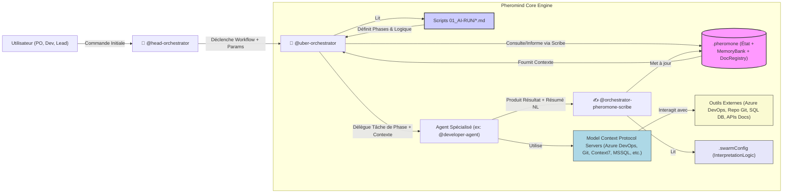
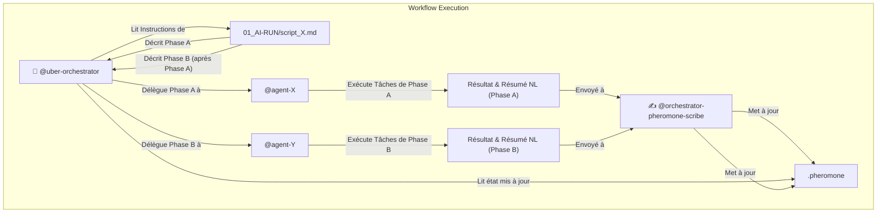
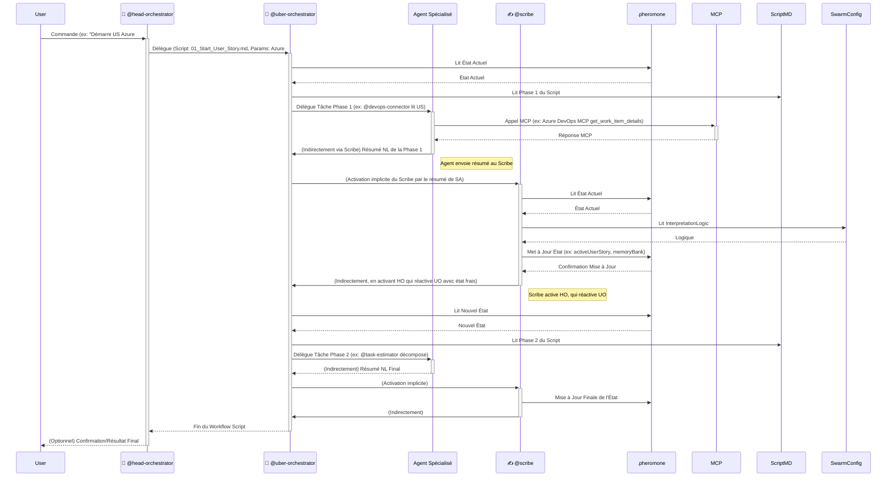

# Concepts du Système d'Assistance IA Agile "AgilePheromind"

**Version:** 1.1
**Date de Dernière Mise à Jour:** 15 mai 2025

## 1. Introduction à AgilePheromind

AgilePheromind est un système d'intelligence artificielle (IA) avancé, conçu comme un **essaim d'agents IA collaboratifs**, propulsé par le framework **Pheromind**. Son but principal est d'assister et d'augmenter les capacités des équipes de développement logiciel qui suivent des méthodologies Agiles, en particulier celles utilisant des technologies comme .NET, Angular, Azure DevOps, Docker et Azure Kubernetes Service (AKS).

Contrairement à un outil IA monolithique, AgilePheromind fonctionne comme un écosystème où des agents spécialisés interagissent indirectement pour accomplir des tâches complexes, apprendre du contexte du projet, et s'adapter aux besoins de l'équipe.

### 1.1. Intégration avec Roo Code

AgilePheromind est conçu pour fonctionner exclusivement sur **Roo Code**, une plateforme avancée d'assistance IA pour le développement logiciel. Cette intégration offre plusieurs avantages clés :

* **Modes Personnalisés :** AgilePheromind utilise le système de modes personnalisés de Roo Code pour définir ses agents spécialisés via le fichier `.roomodes`.
* **Outils Natifs :** Les agents peuvent accéder aux outils natifs de Roo Code pour la lecture/écriture de fichiers, l'exécution de commandes, et la navigation web.
* **Intégration MCP :** Les Model Context Protocol (MCP) servers d'AgilePheromind s'intègrent avec les capacités MCP de Roo Code pour interagir avec des outils externes.
* **Orchestration :** Le système utilise les capacités d'orchestration de Roo Code pour coordonner les différents agents et workflows.

## 2. Principes Fondamentaux de Pheromind Appliqués

AgilePheromind hérite et applique les principes clés du framework Pheromind :

*   **Intelligence en Essaim (Swarm Intelligence) via Stigmergie:** Les agents ne communiquent pas directement entre eux de manière extensive. Ils interagissent en modifiant un environnement partagé, le fichier d'état `.pheromone`. Les actions d'un agent laissent des "traces" (informations) dans `.pheromone` qui influencent le comportement des agents suivants.
*   **Orchestration Hiérarchique et Pilotée par Scripts:**
    *   Le `🎩 @head-orchestrator` reçoit les directives initiales de l'utilisateur.
    *   Il active le `🧐 @uber-orchestrator`, qui interprète des **scripts de workflow** (`01_AI-RUN/*.md`). Ces scripts définissent la séquence logique des opérations pour une tâche donnée (ex: démarrer une User Story).
    *   L'`🧐 @uber-orchestrator` délègue ensuite des phases spécifiques de ces workflows à des **agents IA spécialisés**.
*   **Gestion Centrale de l'État et de la Mémoire (`.pheromone`):** Ce fichier JSON est le cœur du système.
    *   Il contient l'**état opérationnel actuel** (utilisateur actif, tâche en cours, etc.).
    *   Il héberge le `documentationRegistry`, un index de tous les artefacts et documents importants générés ou référencés.
    *   Il maintient la `memoryBank`, une base de connaissances persistante et évolutive du projet (décisions, analyses, historique des US/tâches, conventions, risques, etc.).
*   **Interprétation et Mise à Jour de l'État par le Scribe (`✍️ @orchestrator-pheromone-scribe`):** Cet agent unique est responsable de la lecture des résumés en langage naturel produits par les autres agents et de la mise à jour structurée et intelligente de `.pheromone` en utilisant une logique définie dans `.swarmConfig`.
*   **Modularité et Spécialisation des Agents (`.roomodes`):** Chaque agent IA a un rôle bien défini, des compétences spécifiques (outils MCP qu'il peut utiliser) et des instructions personnalisées (`customInstructions`) stockées dans le fichier `.roomodes`.
*   **Interaction avec l'Environnement Externe (MCPs):** Les agents utilisent des **Model Context Protocol (MCP) servers** pour interagir avec des outils et services externes (Azure DevOps, Git, bases de données MSSQL, APIs de documentation comme Context7, outils de navigation web, etc.).

## 3. Composants Clés du Système

### 3.1. Le Fichier d'État `.pheromone`

C'est le "cerveau" et la mémoire collective du Swarm. Sa structure bien définie est cruciale.

*   **`systemVersion`, `lastUpdated`:** Méta-informations sur le système.
*   **`currentUser`:** Contexte de l'utilisateur interagissant avec Pheromind (ID, nom d'utilisateur Azure DevOps, rôles, préférences, contexte de tâche actuel).
*   **`currentProject`:** Détails du projet Azure DevOps et du dépôt Git actifs.
*   **`currentSprint`:** Informations sur le sprint Agile en cours (ID, objectif, US sélectionnées).
*   **`activeWorkflow`:** Informations sur le script `01_AI-RUN/*.md` en cours d'exécution.
*   **`activeUserStory`, `activeTask`:** Pointeurs vers les éléments de travail actuellement focus par le système.
*   **`documentationRegistry`:** Un dictionnaire clé-valeur où les clés sont des identifiants de document (ex: `us_Azure#123_analysis.md`) et les valeurs sont leurs chemins relatifs ou absolus. Permet aux agents de retrouver facilement les rapports, spécifications, etc.
*   **`systemHealth`:** Informations sur l'état de Pheromind et de ses connexions MCP.
*   **`memoryBank`:** La section la plus dynamique et la plus riche. Elle contient :
    *   `projectContext`: Stack technologique, liens vers les conventions, nom du projet ADO.
    *   `userProfiles`: Informations agrégées sur les utilisateurs du système Pheromind.
    *   `userStories`: Historique détaillé, statuts, tâches liées, analyses, décisions, commits pour chaque US traitée.
    *   `tasks`: Détails similaires pour chaque tâche technique.
    *   `pullRequests`, `commits`: Informations sur les PRs et les commits.
    *   `legacyCodeAnalyses`, `sprintRetrospectivesSummaries`, `technicalDebtItems`, `architecturalDecisions`, `commonIssuesAndSolutions`, `toolingConfigurations`, `riskRegister`, `workflowPerformanceMetrics`: Autant de "bases de connaissances" spécifiques alimentées et consultées par les agents.
*   **`notifications`:** Une file d'attente pour les notifications à destination des utilisateurs.

L'intégrité et la richesse de `.pheromone`, en particulier de la `memoryBank`, conditionnent l'intelligence et l'efficacité d'AgilePheromind.

### 3.2. Les Fichiers de Configuration

*   **`.roomodes`:** Ce fichier JSON définit chaque agent IA spécialisé en utilisant le format de modes personnalisés de Roo Code. Pour chaque agent, il spécifie :
    *   `slug`: Un identifiant unique (ex: `developer-agent`) utilisé par Roo Code pour référencer le mode.
    *   `name`: Un nom lisible (ex: `💻 @developer-agent`) affiché dans l'interface de Roo Code.
    *   `roleDefinition`: Une description générale de son rôle et de ses responsabilités primaires, placée au début du prompt système.
    *   `customInstructions`: Des instructions détaillées et spécifiques sur la manière dont l'agent doit accomplir ses tâches, quels MCPs utiliser, comment interagir avec `.pheromone` (via le Scribe), quels formats de sortie produire, et comment gérer les erreurs. Ces instructions sont le "code source comportemental" de l'agent.
    *   `groups`: Permissions d'accès aux outils de Roo Code (lecture "read", écriture "edit", navigation web "browser", exécution de commandes "command", utilisation de MCPs "mcp").
    *   `whenToUse`: Description optionnelle indiquant quand ce mode doit être utilisé, particulièrement utile pour l'orchestration des tâches.
    *   `source`: Indique l'origine du mode (généralement "project" pour les modes spécifiques au projet).
*   **`.swarmConfig`:** Ce fichier JSON contient principalement la `interpretationLogic` pour le `✍️ @orchestrator-pheromone-scribe`. Cette logique est une série de règles (conditions et actions) qui permettent au Scribe de :
    *   Parser les résumés en langage naturel (NL) des agents.
    *   Extraire des informations structurées (IDs, statuts, chemins de fichiers, décisions).
    *   Savoir quelles sections de `.pheromone` mettre à jour et comment.
    *   Par exemple, une règle peut stipuler : "Si le résumé de `@developer-agent` contient 'Commit effectué avec succès. Hash: {{commitHash}}.', alors ajouter `{{commitHash}}` à `memoryBank.userStories.{{activeUserStory.id}}.relatedCommits`."

### 3.3. Les Scripts de Workflow `01_AI-RUN/*.md`

Ces fichiers Markdown sont les "programmes" que l'`🧐 @uber-orchestrator` exécute. Chaque script correspond à une fonctionnalité de haut niveau d'AgilePheromind (ex: analyser un besoin, générer des tests, réviser une PR).

Un script type contient :

*   **Objectif du Workflow:** Ce que le script accomplit.
*   **Agents IA Clés Impliqués:** Quels agents spécialisés seront probablement sollicités.
*   **MCPs Potentiellement Utilisés.**
*   **Aperçu du Workflow Pheromind:** Les grandes phases logiques.
*   **Détails des Phases:** Pour chaque phase :
    *   L'agent responsable.
    *   Les inputs requis (souvent tirés de `.pheromone`).
    *   Les actions et outils (y compris les appels MCPs spécifiques).
    *   Comment la `memoryBank` ou l'état actif est impacté.
    *   L'output attendu (typiquement un résumé NL pour le Scribe et potentiellement des artefacts).

### 3.4. Les Agents IA Spécialisés

Chaque agent est un LLM configuré avec un rôle et des instructions spécifiques dans `.roomodes`. Ils sont conçus pour exceller dans un domaine particulier. Exemples :

*   `@po-assistant`: Spécialisé dans l'analyse des besoins, la rédaction d'US et d'ACs. Utilise le `Sequential Thinking MCP`.
*   `@developer-agent`: Spécialisé dans l'écriture de code .NET et Angular, la création de tests unitaires, l'utilisation de Git. Utilise `Context7 MCP`, `MSSQL MCP`, `Git Tools MCP`.
*   `@code-reviewer-assistant`: Spécialisé dans l'analyse de code pour la qualité, les conventions, et la coordination de l'analyse de sécurité.
*   `@deployment-agent-aks`: Spécialisé dans la gestion des déploiements sur AKS. Utilise des MCPs Docker, Kubernetes (conceptuels) et Azure DevOps.

La force du système réside dans la capacité de l'`🧐 @uber-orchestrator` à sélectionner et à coordonner le bon agent pour la bonne tâche, en fournissant le contexte nécessaire depuis `.pheromone`.

### 3.5. Les Model Context Protocol (MCP) Servers

Ce sont des services externes qui exposent des fonctionnalités spécifiques via une API structurée que les agents Pheromind peuvent appeler. AgilePheromind s'intègre avec les capacités MCP de Roo Code pour interagir avec divers outils et services. Le système s'appuie sur :

* **Azure DevOps MCP:** Pour toute interaction avec Azure Boards (US, tâches), Azure Repos (PRs), Azure Pipelines.
* **Git Tools MCP:** Pour les opérations Git locales (commit, branch, diff, etc.).
* **Context7 MCP:** Pour obtenir la documentation à jour des librairies et frameworks (.NET, Angular, etc.).
* **MSSQL MCP:** Pour interagir avec la base de données SQL Server (lire schémas, valider/exécuter des requêtes).
* **Browser Tools MCP (Puppeteer/Playwright):** Pour l'automatisation des tests UI et la validation visuelle.
* **Sequential Thinking MCP:** Pour aider les agents à structurer leur pensée et leur analyse pour des tâches complexes (décomposition, planification).
* **Fetch MCP:** En fallback pour scraper des documentations ou exemples si Context7 ne suffit pas.
* **(Conceptuels/Futurs) Docker MCP, Kubernetes/AKS MCP, SonarQube MCP.**

L'utilisation de MCPs permet aux agents de manipuler directement les outils de l'équipe de développement. Grâce à l'intégration avec Roo Code, les agents peuvent accéder à ces MCPs via le groupe de permissions "mcp" défini dans le fichier `.roomodes`.

## 4. Flux d'Information et Cycle de Vie d'une Tâche

Le diagramme suivant illustre un cycle de vie typique d'une commande utilisateur traitée par AgilePheromind :

## 5. La Memory Bank : Le Cœur Apprenant

La `memoryBank` dans `.pheromone` est plus qu'un simple log. C'est une base de connaissances structurée qui permet au système de :

*   **Conserver le Contexte à Long Terme:** Se souvenir des décisions architecturales passées, des estimations de tâches similaires, des solutions à des problèmes récurrents.
*   **Apprendre des Interactions:** Par exemple, `@task-breakdown-estimator` peut potentiellement affiner ses estimations futures en comparant les estimations passées (stockées) avec le temps réel passé (si cette donnée est remontée).
*   **Fournir un Contexte Riche aux Agents:** Avant de démarrer une tâche, un agent peut consulter la `memoryBank` pour des informations pertinentes sur l'US, les tâches sœurs, les conventions, etc.
*   **Assurer la Cohérence:** Les conventions de codage et de design y sont référencées, garantissant que tous les agents (et les humains) travaillent à partir des mêmes standards.
*   **Suivre l'Évolution:** Historique des statuts, des reviews, des déploiements.

La qualité des informations stockées dans la `memoryBank` et la capacité du `✍️ @orchestrator-pheromone-scribe` à l'alimenter et à l'exploiter correctement sont déterminantes pour l'intelligence globale d'AgilePheromind.

## 6. Personnalisation et Évolution

AgilePheromind est conçu pour être adaptable :

* **`.roomodes`:** Les instructions des agents peuvent être affinées, et de nouveaux agents peuvent être ajoutés pour couvrir de nouveaux besoins. Ce fichier suit le format de modes personnalisés de Roo Code, ce qui permet d'utiliser toutes les fonctionnalités de personnalisation offertes par la plateforme.
* **`01_AI-RUN/*.md`:** De nouveaux workflows peuvent être créés pour automatiser ou assister de nouvelles tâches. Les workflows existants peuvent être modifiés.
* **`.swarmConfig`:** La logique d'interprétation du Scribe peut être étendue pour comprendre de nouveaux types de résumés ou pour enrichir la `memoryBank` de manière plus fine.
* **MCPs:** De nouveaux MCPs peuvent être intégrés pour connecter AgilePheromind à d'autres outils ou services, en tirant parti des capacités d'extension de Roo Code.
* **Instructions spécifiques aux modes:** Des instructions supplémentaires peuvent être fournies via les dossiers `.roo/rules-{slug}/` ou les fichiers `.roorules-{slug}` de Roo Code pour personnaliser davantage le comportement des agents.

Le système peut ainsi évoluer avec les processus et les technologies de l'équipe. Des agents comme `@workflow-optimizer-agent` et `@swarm-monitor-agent` sont spécifiquement conçus pour aider à cette évolution en analysant les performances du système et en suggérant des améliorations.

### 6.1. Intégration avec les Fonctionnalités Avancées de Roo Code

AgilePheromind tire parti de plusieurs fonctionnalités avancées de Roo Code :

* **Orchestration de tâches:** Utilisation du mode Orchestrator (Boomerang) de Roo Code pour coordonner les workflows complexes.
* **Changement de modes:** Les agents peuvent passer d'un mode à l'autre selon les besoins de la tâche en cours.
* **Modèles persistants par mode:** Chaque agent peut utiliser un modèle d'IA différent, optimisé pour sa tâche spécifique.
* **Restrictions d'accès aux fichiers:** Les permissions définies dans `.roomodes` permettent de limiter l'accès des agents à certains types de fichiers pour plus de sécurité.

## Conclusion

AgilePheromind représente une approche sophistiquée de l'assistance IA pour les équipes Agiles. En combinant une architecture d'essaim flexible, une gestion d'état centralisée et intelligente, et une intégration profonde avec les outils existants via Roo Code, il a le potentiel de transformer la manière dont les équipes développent des logiciels. Son succès repose sur la clarté des workflows définis, la précision des instructions des agents, et l'intelligence du mécanisme d'interprétation et de mise à jour de la `memoryBank`.

L'intégration native avec Roo Code permet à AgilePheromind de bénéficier d'une plateforme robuste et extensible, tout en offrant une expérience utilisateur fluide et cohérente. Cette synergie entre le framework Pheromind et les capacités de Roo Code crée un système d'assistance IA véritablement adapté aux besoins des équipes de développement Agile modernes.
