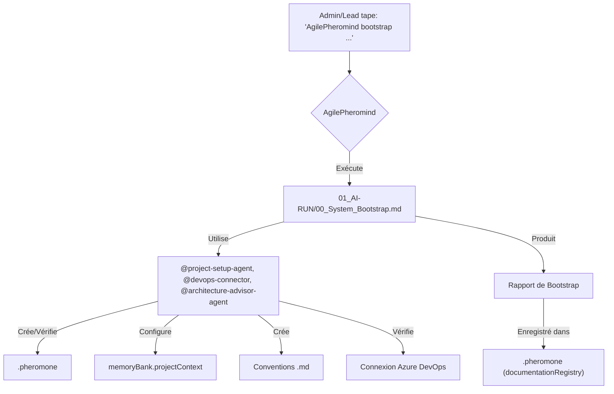

# Manuel d'Utilisation du Système AgilePheromind

**Version:** 1.0
**Date de Dernière Mise à Jour:** {{TIMESTAMP_PAR_PHEROMIND}}

Bienvenue dans le manuel d'utilisation d'AgilePheromind ! Ce guide vous aidera à comprendre comment interagir avec le système pour optimiser vos processus de développement Agile.

## 1. Introduction à l'Interaction avec AgilePheromind

AgilePheromind est un système d'assistance IA conçu pour s'intégrer à votre flux de travail. Vous interagirez principalement avec lui en donnant des **commandes textuelles** (similaires à des prompts) au `🎩 @head-orchestrator` via votre interface Roo Code (ou un autre outil compatible).

Chaque commande initie un **workflow** défini dans un script `01_AI-RUN/*.md`. Le système utilisera ensuite ses agents spécialisés et sa `memoryBank` (stockée dans `.pheromone`) pour exécuter la tâche demandée.

**Format Général des Commandes:**

Bien que le format exact puisse varier légèrement en fonction de votre interface, une commande typique ressemblera à :

`AgilePheromind [Action/Verbe] [Objet/Cible] [Paramètres Optionnels]`

Ou, en utilisant directement le nom de l'orchestrateur principal si votre interface le permet :

`@head-orchestrator [Action/Verbe] [Objet/Cible] [Paramètres Optionnels]`

Le système est conçu pour comprendre le langage naturel dans une certaine mesure, mais des commandes claires et précises donneront de meilleurs résultats.

## 2. Configuration Initiale (Pour l'Administrateur/Tech Lead)

Avant la première utilisation ou après des changements majeurs, le système doit être initialisé.

### 2.1. Bootstrap du Système

*   **Commande Exemple:**
    `AgilePheromind bootstrap système pour projet AzureDevOps "SuperAppProject" dans organisation "MaSuperOrganisation"`
*   **Workflow Déclenché:** `01_AI-RUN/00_System_Bootstrap.md`
*   **Action d'AgilePheromind:**
    1.  Initialise ou vérifie le fichier d'état `.pheromone`.
    2.  Configure le contexte du projet (stack, nom du projet ADO, URL du repo) dans la `memoryBank`.
    3.  Crée les fichiers de conventions de codage et de design initiaux (`coding_conventions.md`, `design_conventions.md`) à partir de modèles.
    4.  Vérifie la connexion à Azure DevOps.
    5.  Produit un rapport de bootstrap.
*   **Prérequis:**
    *   Les fichiers `.roomodes` et `.swarmConfig` doivent être correctement configurés.
    *   L'Azure DevOps MCP doit être configuré avec les droits d'accès nécessaires.
*   **Résultat Attendu:** AgilePheromind est prêt à fonctionner pour le projet spécifié. `.pheromone` est initialisé.

## 3. Cas d'Usage pour le Product Owner (PO)

### 3.1. Analyser un Besoin Client et Générer des User Stories

*   **Commande Exemple:**
    `AgilePheromind analyse besoin client: "Nos utilisateurs veulent une inscription plus rapide via Google ou Facebook car le formulaire actuel est trop long."`
*   **Workflow Déclenché:** `01_AI-RUN/03_PO_Analyze_Need.md`
*   **Action d'AgilePheromind:**
    1.  `@po-assistant` analyse le besoin en utilisant le `Sequential Thinking MCP`.
    2.  Propose des ébauches de User Stories (US) avec des Critères d'Acceptation (ACs).
    3.  `@devops-connector` vérifie si des US similaires existent déjà dans le backlog Azure DevOps.
    4.  Génère un rapport d'analyse (`po_need_analysis_*.md`) et le stocke.
    5.  Vous demande (via `ask_followup_question`) si vous souhaitez visualiser le rapport, créer les US suggérées dans Azure DevOps, ou discuter d'une US spécifique.
*   **Résultat Attendu:** Vous recevez une analyse structurée, des propositions d'US/ACs, et une vérification de doublons pour accélérer la préparation de votre backlog.

## 4. Cas d'Usage pour les Développeurs (Dev)

### 4.1. Démarrer le Travail sur une User Story

*   **Commande Exemple:**
    `AgilePheromind commence US Azure#12323`
*   **Workflow Déclenché:** `01_AI-RUN/01_Start_User_Story.md`
*   **Action d'AgilePheromind:**
    1.  `@devops-connector` identifie votre utilisateur Azure DevOps et récupère les détails de l'US #12323.
    2.  Le système met à jour `.pheromone` pour marquer cette US comme active pour vous.
    3.  `@task-breakdown-estimator` vérifie/effectue la décomposition de l'US en tâches techniques et les estime (si nécessaire), en utilisant `Context7 MCP` pour la documentation technique et `MSSQL MCP` pour l'analyse de schéma DB. Les tâches sont synchronisées avec Azure DevOps.
    4.  `@developer-agent` prépare la première tâche `ToDo`, crée une branche Git (ex: `feature/US12323-description`) via `Git Tools MCP`.
*   **Résultat Attendu:** L'US est officiellement démarrée, les tâches sont claires, et votre environnement de développement est prêt pour la première tâche. L'état est tracé dans `.pheromone`.

### 4.2. Continuer le Travail sur une Tâche Spécifique

*   **Commande Exemple:**
    `AgilePheromind continue tâche Azure#23223`
*   **Workflow Déclenché:** `01_AI-RUN/02_Continue_Task.md`
*   **Action d'AgilePheromind:**
    1.  `@devops-connector` récupère le contexte à jour de la tâche #23223 depuis Azure DevOps.
    2.  Le système active cette tâche dans `.pheromone`.
    3.  `@developer-agent` charge le contexte détaillé de la tâche depuis la `memoryBank` (notes précédentes, décisions, snippets).
    4.  Vérifie votre branche Git actuelle et vous guide pour changer si nécessaire (via `Git Tools MCP`).
    5.  Pendant que vous codez, vous pouvez demander à `@developer-agent` (ou directement à AgilePheromind) :
        *   D'obtenir de la documentation via `Context7 MCP` (ex: `"AgilePheromind doc pour 'EF Core Include'"`).
        *   D'analyser un schéma de table via `MSSQL MCP` (ex: `"AgilePheromind schéma table Orders"`).
        *   De générer des tests unitaires (voir section 4.3).
*   **Résultat Attendu:** Vous reprenez votre travail avec tout le contexte nécessaire. AgilePheromind est prêt à vous assister.

### 4.3. Générer des Squelettes de Tests Unitaires

*   **Commande Exemple:**
    `AgilePheromind génère tests unitaires pour méthode "CalculateDiscount" dans classe "PricingService"`
*   **Workflow Déclenché:** `01_AI-RUN/04_Generate_Unit_Tests.md`
*   **Action d'AgilePheromind:**
    1.  `@test-generator-agent` analyse le code de `PricingService.CalculateDiscount` (via `Git Tools MCP`).
    2.  Consulte les ACs de l'US/tâche active dans `.pheromone` pour comprendre le comportement attendu.
    3.  Utilise `Context7 MCP` pour la documentation du framework de test (.NET ou Angular) et des librairies de mocking.
    4.  Identifie les cas de test (nominaux, limites, erreurs) en utilisant le `Sequential Thinking MCP`.
    5.  Génère un fichier de test (ex: `PricingServiceTests.cs` ou `pricing.service.spec.ts`) avec des squelettes de méthodes de test (Arrange/Act/Assert).
    6.  Vous informe que les squelettes sont prêts à être complétés.
*   **Résultat Attendu:** Vous gagnez du temps avec des squelettes de tests pertinents pour votre code.

### 4.4. Finaliser une Tâche et Préparer un Commit

*   **Commande Exemple:**
    `AgilePheromind: Tâche Azure#23223 terminée. Prépare commit pour US Azure#12323.`
*   **Workflow Déclenché:** `01_AI-RUN/06_Finalize_Task_Commit.md`
*   **Action d'AgilePheromind:**
    1.  `@developer-agent` exécute les linters et les tests unitaires/intégration pertinents. Si des problèmes sont détectés, il vous en informe et arrête le processus.
    2.  Si OK, `@commit-pr-formatter` récupère les informations de l'US/tâche et les fichiers modifiés (via `Git Tools MCP`).
    3.  Propose un message de commit respectant "Conventional Commits".
    4.  Vous demande (via `ask_followup_question`) de valider ou modifier le message.
    5.  Si validé, `@developer-agent` (ou `@commit-pr-formatter`) effectue le commit via `Git Tools MCP`.
    6.  `@devops-connector` met à jour le statut de la tâche #23223 à "Terminé" (ou équivalent) dans Azure DevOps.
    7.  Le `✍️ @orchestrator-pheromone-scribe` met à jour `.pheromone` (statut de la tâche, lien vers le commit).
*   **Résultat Attendu:** Votre code est commité proprement, la tâche est marquée comme terminée localement et dans Azure DevOps.

### 4.5. Générer/Mettre à Jour la Documentation Technique

*   **Commande Exemple:**
    `AgilePheromind documente service "OrderProcessingService"`
    Ou (après un commit):
    `AgilePheromind màj documentation pour les changements liés à US Azure#12323`
*   **Workflow Déclenché:** `01_AI-RUN/10_Generate_Tech_Docs.md`
*   **Action d'AgilePheromind:**
    1.  `@documentation-writer-agent` identifie le code source pertinent (via nom ou commits liés à l'US).
    2.  Analyse le code, les commentaires (XML Docs, JSDoc), et les specs de l'US/tâche depuis `.pheromone`.
    3.  Utilise `Context7 MCP` pour la documentation des librairies utilisées.
    4.  Génère/met à jour un fichier Markdown dans `02_AI-DOCS/Technical/` avec une structure appropriée (API, exemples, etc.).
*   **Résultat Attendu:** Une documentation technique à jour pour le module ou la fonctionnalité spécifiée.

## 5. Cas d'Usage pour le Tech Lead / Architecte

### 5.1. Assister à la Revue d'une Pull Request

*   **Commande Exemple:**
    `AgilePheromind analyse PR Azure#456`
*   **Workflow Déclenché:** `01_AI-RUN/05_Review_Pull_Request.md`
*   **Action d'AgilePheromind:**
    1.  `@devops-connector` récupère les détails de la PR #456 (fichiers modifiés, diffs, branche source).
    2.  Un répertoire `04_PR_REVIEWS/[nom_branche_source_PR]/` est créé/utilisé.
    3.  `@code-reviewer-assistant` analyse les modifications pour :
        *   Respect des conventions de codage (depuis `memoryBank.projectContext.codingConventionsLink`).
        *   "Code smells" et anti-patterns (.NET/Angular).
        *   Vérifie la couverture des tests.
        *   Utilise `Context7 MCP` pour vérifier l'usage des librairies.
    4.  Collabore avec `@security-analyst-agent` pour détecter les vulnérabilités courantes.
    5.  Génère un rapport de revue (`pr_456_review_*.md`) dans le répertoire dédié, listant les problèmes par sévérité et suggérant des améliorations.
*   **Résultat Attendu:** Vous recevez un rapport d'analyse pour guider votre revue manuelle et identifier rapidement les points critiques.

### 5.2. Analyser du Code Legacy pour une Migration

*   **Commande Exemple:**
    `AgilePheromind analyse code VB6 de "[chemin_vers_sources_legacy]" pour migration vers .NET Core et Angular.`
*   **Workflow Déclenché:** `01_AI-RUN/09_Legacy_Migration_Analysis.md`
*   **Action d'AgilePheromind:**
    1.  `@migration-analyst-agent` ingère le code legacy.
    2.  Analyse les composants (modules, UI, logique métier, accès aux données via `MSSQL MCP` pour les SPs).
    3.  Identifie les dépendances (utilisant `Fetch MCP` pour les plus obscures).
    4.  Propose un mapping vers la stack .NET Core/Angular (s'aidant de `Context7 MCP` pour les technos modernes).
    5.  Suggère des stratégies de migration.
    6.  Estime la complexité et identifie les risques.
    7.  Génère un rapport d'analyse détaillé (`legacy_analysis_*.md`).
*   **Résultat Attendu:** Un rapport complet pour planifier et estimer l'effort de migration.

### 5.3. Analyser la Dette Technique du Projet

*   **Commande Exemple:**
    `AgilePheromind analyse dette technique projet`
    Ou pour un module :
    `AgilePheromind analyse dette technique module "AuthenticationService"`
*   **Workflow Déclenché:** `01_AI-RUN/11_Analyze_Tech_Debt.md`
*   **Action d'AgilePheromind:**
    1.  `@code-reviewer-assistant` récupère le code du périmètre défini.
    2.  Exécute les linters et des analyses heuristiques pour "code smells" (duplication, complexité, etc.).
    3.  Utilise `Context7 MCP` pour vérifier les bonnes pratiques des librairies dans les zones suspectes.
    4.  Peut s'interfacer avec un MCP SonarQube (si disponible) pour une analyse plus poussée.
    5.  Génère un rapport (`tech_debt_analysis_*.md`) listant les problèmes, leur sévérité, et des suggestions de refactoring.
    6.  Met à jour la section `technicalDebtItems` de la `memoryBank`.
*   **Résultat Attendu:** Une vision claire de la dette technique et des pistes pour l'améliorer.

### 5.4. Gérer les Déploiements Docker sur AKS

*   **Commande Exemple:**
    `AgilePheromind déploie "MyDotnetAPI" version "v1.1.0" sur AKS environnement "staging"`
*   **Workflow Déclenché:** `01_AI-RUN/16_Manage_Docker_AKS_Deployment.md`
*   **Action d'AgilePheromind:**
    1.  `@deployment-agent-aks` vérifie si l'image Docker existe dans ACR ou si un build est requis.
    2.  Récupère les Dockerfiles et manifestes Kubernetes depuis Git (via `Git Tools MCP`).
    3.  Si besoin, build l'image Docker et la push vers ACR (via MCP Docker ou CLI).
    4.  Déploie sur AKS :
        *   Option 1 (préférée) : Déclenche un pipeline Azure DevOps (via `@devops-connector` et `Azure DevOps MCP`).
        *   Option 2 : Applique directement les manifestes K8s (via MCP Kubernetes/AKS ou CLI `kubectl`).
    5.  Effectue des vérifications basiques post-déploiement (statut des pods/services).
    6.  Génère un rapport et met à jour `.pheromone.memoryBank.deployments`.
*   **Résultat Attendu:** L'application est déployée/mise à jour sur AKS, avec un suivi dans Pheromind.

### 5.5. Maintenir les Conventions du Projet

*   **Commande Exemple:**
    `AgilePheromind révise et màj conventions de codage .NET`
*   **Workflow Déclenché:** `01_AI-RUN/17_Maintain_Project_Conventions.md`
*   **Action d'AgilePheromind:**
    1.  `@architecture-advisor-agent` lit les conventions actuelles (`coding_conventions.md`, `design_conventions.md`) et les feedbacks/problèmes de la `memoryBank`.
    2.  Recherche les bonnes pratiques à jour pour .NET/Angular via `Context7 MCP`.
    3.  Prépare des propositions de modifications pour les fichiers de conventions.
    4.  Vous soumet ces propositions pour validation (via `ask_followup_question`).
    5.  Si approuvé, met à jour les fichiers .md et les commit (via `Git Tools MCP`).
    6.  Met à jour la version des conventions dans `memoryBank.projectContext`.
*   **Résultat Attendu:** Les documents de conventions du projet sont maintenus à jour et reflètent les décisions de l'équipe.

## 6. Cas d'Usage pour les Testeurs (QA)

### 6.1. Valider l'Interface Utilisateur (UI)

*   **Commande Exemple:**
    `AgilePheromind valide UI pour US Azure#12323 sur environnement "https://test.myapp.com"`
*   **Workflow Déclenché:** `01_AI-RUN/12_UI_Test_Validation.md`
*   **Action d'AgilePheromind:**
    1.  `@devops-connector` récupère les ACs de l'US.
    2.  `@tester-ui-validator-agent` lit les `design_conventions.md` et mockups depuis la `memoryBank`/`documentationRegistry`.
    3.  L'agent définit un scénario de test UI.
    4.  Utilise le `Browser Tools MCP` (Puppeteer/Playwright) pour naviguer sur l'URL fournie, interagir avec les éléments (clics, formulaires), prendre des captures d'écran à différentes résolutions, et vérifier les erreurs console.
    5.  Compare les résultats avec les spécifications de design et les ACs.
    6.  Génère un rapport de validation (`ui_validation_report_*.md`) listant les conformités et les écarts/bugs.
    7.  Si des bugs sont trouvés, le système peut vous proposer de les créer dans Azure DevOps.
*   **Résultat Attendu:** Un rapport détaillé de la validation UI, facilitant l'identification des problèmes visuels et fonctionnels.

## 7. Cas d'Usage pour le Scrum Master / Gestion de Projet

### 7.1. Assister à la Planification de Sprint

*   **Commande Exemple:**
    `AgilePheromind planifie sprint. US candidates: Azure#123, Azure#456. Capacité: 35 points.`
*   **Workflow Déclenché:** `01_AI-RUN/07_Sprint_Planning_Assistant.md`
*   **Action d'AgilePheromind:**
    1.  `@devops-connector` récupère les détails des US candidates.
    2.  `@task-breakdown-estimator` vérifie/effectue les estimations et décompositions en tâches pour chaque US.
    3.  `@scrum-facilitator-agent` propose un plan de sprint basé sur la capacité, les priorités des US et les dépendances.
    4.  Génère un rapport (`sprint_plan_proposal_*.md`).
*   **Résultat Attendu:** Une proposition de plan de sprint pour aider l'équipe à finaliser son engagement.

### 7.2. Obtenir un Support pour le Daily Stand-up

*   **Commande Exemple:**
    `AgilePheromind résumé Daily pour Sprint "{{currentSprint.name}}"`
*   **Workflow Déclenché:** `01_AI-RUN/08_Daily_Standup_Support.md`
*   **Action d'AgilePheromind:**
    1.  `@devops-connector` récupère les statuts récents depuis Azure DevOps pour le sprint en cours.
    2.  `@scrum-facilitator-agent` analyse `.pheromone.memoryBank` (commits, notes, statuts Pheromind).
    3.  Identifie les progrès, les tâches sans progression, et les bloquants potentiels.
    4.  Génère un rapport (`daily_standup_summary_*.md`).
*   **Résultat Attendu:** Un résumé concis pour un Daily Stand-up plus efficace.

### 7.3. Gérer Proactivement les Risques

*   **Commande Exemple:**
    `AgilePheromind lance analyse des risques projet`
*   **Workflow Déclenché:** `01_AI-RUN/14_Proactive_Risk_Management.md`
*   **Action d'AgilePheromind:**
    1.  `@risk-manager-agent` scanne `.pheromone` et Azure DevOps (via `@devops-connector`) pour des indicateurs de risque.
    2.  Évalue et priorise les risques identifiés (impact, probabilité).
    3.  Met à jour le `memoryBank.riskRegister`.
    4.  Peut proposer des plans de mitigation pour les risques critiques.
    5.  Génère un rapport (`risk_assessment_report_*.md`).
*   **Résultat Attendu:** Un registre des risques à jour et des alertes sur les points critiques.

## 8. Workflows d'Amélioration du Système Pheromind

### 8.1. Suggérer des Optimisations du Système

*   **Commande Exemple:**
    `AgilePheromind analyse ses workflows pour optimisation`
*   **Workflow Déclenché:** `01_AI-RUN/15_Optimize_Workflow_Suggestion.md`
*   **Action d'AgilePheromind:**
    1.  `@workflow-optimizer-agent` analyse l'historique des workflows, les métriques de performance et les rapports du `@swarm-monitor-agent`.
    2.  Identifie les goulots d'étranglement, les inefficacités.
    3.  Génère des suggestions d'optimisation pour les scripts `01_AI-RUN/*.md`, les agents `.roomodes`, ou le `.swarmConfig`.
    4.  Produit un rapport (`system_optimization_suggestions_*.md`).
*   **Résultat Attendu:** Des pistes concrètes pour améliorer l'efficacité d'AgilePheromind lui-même.

## 9. Dépannage et Bonnes Pratiques

*   **Soyez Spécifique:** Plus votre commande est précise (IDs d'US/tâches, noms de méthodes/classes), meilleurs seront les résultats.
*   **Utilisez les IDs Azure DevOps:** Préfixez toujours les IDs d'US et de tâches par `Azure#` (ex: `Azure#12323`) pour aider le système à les identifier correctement.
*   **Consultez `.pheromone` (avec précaution):** Si vous avez un accès en lecture, le fichier `.pheromone` peut vous donner un aperçu de l'état actuel et de la `memoryBank`. Ne le modifiez JAMAIS manuellement.
*   **Itérer avec le Système:** Si une proposition d'AgilePheromind n'est pas parfaite, donnez-lui un feedback pour affiner. Par exemple, si un message de commit n'est pas idéal, demandez une modification.
*   **Signaler les Erreurs:** Si AgilePheromind commet une erreur ou semble bloqué, signalez-le. Cela aidera à améliorer le système (via le workflow d'optimisation).

Ce manuel d'utilisation est un point de départ. À mesure que vous utiliserez AgilePheromind, vous découvrirez de nouvelles façons de l'intégrer à votre travail quotidien. N'hésitez pas à expérimenter (sur des branches de test pour les opérations Git !) et à fournir du feedback pour son amélioration continue.